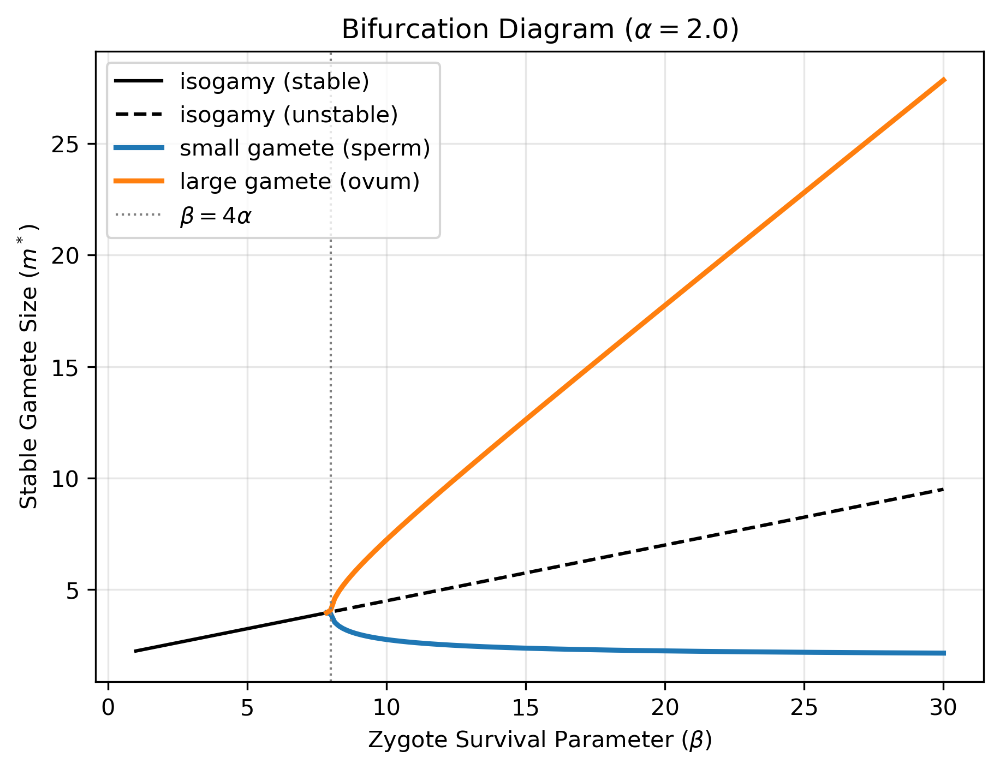

# anisogamy

A computational reproduction of the disruptive-selection theory for the origin of sperm and eggs.



## The question

Most multicellular organisms (with 2 mating types) produce 2 sharply different gamete sizes--many tiny ones (sperm) or few large ones (egg)--with nothing in between. Unicellular organisms are often isogamous, so sexual reproduction does not automatically produce this split. Something has to break the symmetry.

Parker, Baker & Smith (1972) proposed that disruptive selection provides this force. Each parent has a fixed budget (the resource available to produce gametes), so gamete size and gamete number trade off against each other. Small producers win by capturing fusions with well-provisioned partners; large producers win by making zygotes that survive. Intermediates do not do well and are eventually eliminated.

Bulmer & Parker (2002) put that argument on game-theoretic footing. They model two mating types whose gamete sizes coevolve, and ask when the isogamous equilibrium is REACHABLE rather than merely UNINVADABLE. The answer turns on a single comparison between two parameters: α, which scales gamete survival, and β, which scales zygote survival. When β exceeds 4α, isogamy loses convergence stability and the system settles into two distinct gamete sizes.

The biological reading is that multicellularity pushes β to the right while leaving α roughly where it was--a zygote that must build a body needs far more provisioning than a gamete needs to survive to fusion--so anisogamy becomes inevitable as organisms become complex.

## What this reproduces

Every result below is checked by a test against the published value.

| Result | Source | Status |
| --- | --- | --- |
| Vance survival function inflects at *m* = α/2 | §2b | verified |
| Isogamous ESS *m*\* = α + β/4 | eq. 2.6 | verified |
| Best-response slope *R*′(*m*\*) = −β/4α | eq. 2.9 | verified |
| Bifurcation threshold at β = 4α | §2b | verified |
| Anisogamous pair (1.13, 8.87) at α = 1, β = 10 | Fig. 1(f) | verified |
| Zygote size *S* = β at the anisogamous ESS (Smith–Fretwell optimum) | §2b | verified |

The bifurcation diagram above does not appear in either paper. It summarizes the whole result in one figure: a single stable gamete size up to β = 4α (bifurcation threshold), then a pitchfork, with the isogamous equilibrium continuing as a dashed line, still an equilibrium, no longer reachable.

## A note on the numerics

The best response is found by solving the first-order condition, which reduces to a cubic in *m*₁:

```
-m₁³ + (α + β - 2m₂)m₁² + (2αm₂ - m₂²)m₁ + αm₂² = 0
```

Above β = 32α this cubic has three real positive roots, and the middle one is a *minimum* of fitness rather than a maximum. Naive root-finding (a bracketed solver such as Brent's method, i.e, brentq from scipy.optimize) returns whichever root happens to fall inside the bracket, silently giving the wrong answer in that regime. `best_response` therefore takes all roots, discards complex and non-positive ones, and selects whichever surviving candidate maximizes log fitness.

A brute-force grid search is kept alongside it as `best_response_grid`, and a test asserts the two agree across β values spanning both the 4α and 32α thresholds.

Two further details: Fitness is computed in logs, which turns the three multiplied terms of eq. 2.1 into a sum and drops the reproductive budget *M* as an additive constant (the ESS does not depend on it, also in Bulmer and Parker). And right at β = 4α the best-response slope is exactly −1, so convergence becomes arbitrarily slow and the two-cycle amplitude grows continuously from zero; classification near the threshold is correspondingly imprecise. That is a property of pitchfork bifurcations, not of the implementation.

## Installation

```bash
git clone https://github.com/Patra-arya/anisogamy.git
cd anisogamy
pip install -e .
```

## Usage

```python
import numpy as np
from anisogamy.dynamics import classify
from anisogamy.plot import plot_bifurcation

classify(alpha=1.0, beta=1.0)
# {'regime': 'isogamy', 'sizes': array([1.25])}

classify(alpha=1.0, beta=10.0)
# {'regime': 'anisogamy', 'sizes': array([1.127, 8.873])}

plot_bifurcation(alpha=1.0, betas=np.linspace(1, 40, 200))
```

Run the test suite with:

```bash
pytest
```

Worked examples are in `Notebook/`.

## Repository structure

```
src/anisogamy/
├── survival.py        g(m) and f(S): Vance sigmoid, complementary
│                      exponential, and threshold forms
├── fitness.py         reproductive fitness (eq. 2.1) and the analytic
│                      isogamous ESS
├── best_response.py   R(m) via cubic roots, with a grid-search check
├── dynamics.py        iteration of the best-response map; classification
│                      into isogamy or anisogamy; parameter sweeps
└── plot.py            best-response maps, cobweb diagrams, bifurcation

tests/                 one module per source module
Notebook/              worked examples and figure generation
```

## Interpretation and limitations

-  This is a one-to-one replication of the Bulmer and Parker (2002), paper. This paper, as does Parker, Baker, and Smith (1972), assumes that all gametes find mates to form zygotes. This describes gamete-competition regime. Further reading should include Lehtonen and Kokko (2011).
- This model also assumes two mating-types, but in nature we find three, four, and up to thousands of mating-types from a single species. Hurst and Hamilton (1992) argue a model for two mating-types (cytoplasmic genetic material conflict {Uni-parental Inheritance}), and many papers follow-up with different theories. This is a genuinely unsolved (worked-upon) question in the field.
- *FROM Bulmer and Parker*: In unicellular organisms, one might expect β≈α, leading to isogamy. In the early stages of multicellularity, one might expect that α would stay roughly constant, but β would increase with the need to provision the embryo; when it has increased more than fourfold the scene for the evolution of anisogamy is set.
- *FROM Bulmer and Parker*: Once gametes become dimorphic, other selective forces are involved in the subsequent specialization of micro- and
macrogametes.

## On AI usage
AI was used to modify and sometimes co-write code. The author takes full responsibility.

## References

Parker, Geoff A., Robin R. Baker, and V. G. F. Smith. "The origin and evolution of gamete dimorphism and the male-female phenomenon." Journal of theoretical biology 36.3 (1972): 529-553.

Bulmer, M. G., and G. A. Parker. "The evolution of anisogamy: a game-theoretic approach." Proceedings of the Royal Society B: Biological Sciences 269.1507 (2002): 2381.

Smith, Christopher C., and Stephen D. Fretwell. "The optimal balance between size and number of offspring." The American Naturalist 108.962 (1974): 499-506.

Vance, Richard R. "On reproductive strategies in marine benthic invertebrates." The American Naturalist 107.955 (1973): 339-352.

Lehtonen, Jussi, and Hanna Kokko. "Two roads to two sexes: unifying gamete competition and gamete limitation in a single model of anisogamy evolution." Behavioral ecology and sociobiology 65.3 (2011): 445-459.

Hurst, Laurence D., and William D. Hamilton. "Cytoplasmic fusion and the nature of sexes." Proceedings: Biological Sciences (1992): 189-194.

## Licence

MIT
